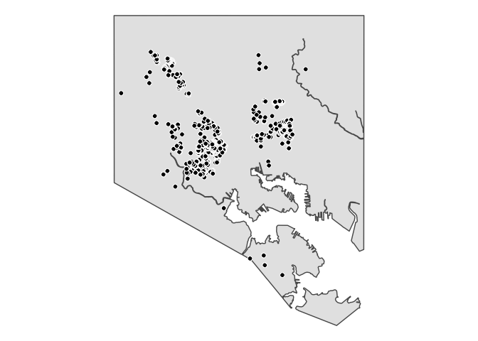

Processing: vacant buildings to be demolished
---------------------------------------------

This notebook reads in data on vacant buildings scheduled from demolition and processes it into cleaned data files for analysis. It also adds geographical coordinates for each vacant building in Baltimore that is scheduled for demolition and saves GIS shapefiles.

### Load R libraries

``` r
library('stringr')
library('tidyverse')
library('janitor')
library('sf')
```

### Load data

Data on vacant buildings scheduled for demolition is from a file provided by the Baltimore City Department of Housing & Community Development. Let's read in the data and save it in the `demolish` dataframe. We'll also filter out buildings whose demolition is already complete.

The property or parcel boundaries are provded in [Open Baltimore](https://data.baltimorecity.gov/Geographic/Parcels-Shape/jk3c-vrfy). We'll save this in the `properties` dataframe.

``` r
demolish <- read_csv('input/demolish_list.csv') %>% clean_names() %>% filter(status_2 != 'Completed')
properties <- st_read('input/Parcel/parcel.shp')
```

    ## Reading layer `parcel' from data source `/Users/czhang/Documents/vacant/vacants-demolition-analysis/input/Parcel/parcel.shp' using driver `ESRI Shapefile'
    ## Simple feature collection with 224258 features and 19 fields
    ## geometry type:  MULTIPOLYGON
    ## dimension:      XY
    ## bbox:           xmin: 1393948 ymin: 557750.4 xmax: 1445503 ymax: 621405
    ## epsg (SRID):    NA
    ## proj4string:    +proj=lcc +lat_1=38.3 +lat_2=39.45 +lat_0=37.66666666666666 +lon_0=-77 +x_0=399999.9999999999 +y_0=0 +datum=NAD83 +units=us-ft +no_defs

### Clean data

The `demolish` dataframe has a couple of addresses that are listed as ranges -- some lots have been consolidated (e.g., "520-522 BAKER STREET" is actually 520 BAKER STREET). We'll re-format these and make `no` a numeric variable.

The `properties` dataframe does not list out half-numbered properties as separate building numbers (e.g., "2 1/2 S MONROE ST" is given a `BLDG_NO` of 2). We will create a new variable, `no`, that adds the half numbers.

``` r
demolish <- demolish %>% mutate(no = as.numeric(case_when(no == '520-522' ~ '520',
                                               no == '2105-2107' ~ '2105',
                                               TRUE ~ no)))

properties <- properties %>% mutate(no = as.numeric(case_when(grepl('1/2', FULLADDR) ~ 
                                                              paste0(as.character(BLDG_NO), '.5'),
                                                   TRUE ~ as.character(BLDG_NO))))
```

Create a column, `address`, in each dataframe that is the full address of each properties. Note that some of the addresses in `demolish` are duplicated. A couple of them are actual duplicates, which should be removed. Some of these are "descriptive" addresses, meaning they won't show up on the map. Some are "half" addresses ( for more detail, see <https://docs.google.com/document/d/1FO2jHWHrO-nOm1I-atC5zs0PdCfLL9R3PVc3O17APSQ/edit?usp=sharing> ). Let's clean these up

``` r
demolish <- demolish %>% mutate(address = ifelse(is.na(dir), paste(no, toupper(street), toupper(suff)),
                                                 paste(no, dir, toupper(street), toupper(suff))))

properties <- properties %>% mutate(address = ifelse(is.na(STDIRPRE), paste(no, ST_NAME, ST_TYPE),
                                                     paste(no, STDIRPRE, ST_NAME, ST_TYPE)))

length(demolish$address)
```

    ## [1] 1852

``` r
length(unique(demolish$address))
```

    ## [1] 1845

``` r
demolish <- demolish %>% group_by(address) %>% mutate(n = n(), 
                                                      rank = row_number())

# demolish %>% filter(n > 1) %>% arrange(address) %>% View()

demolish <- demolish %>% ungroup() %>% mutate(address = case_when(address == '1802 W LAFAYETTE AVE' & rank == 2 ~ 
                                                      '1802.5 W LAFAYETTE AVE',
                                                    address == '3332 WOODLAND AVE' & rank == 2 ~ 
                                                      '3332.5 WOODLAND AVE',
                                                    address == '3330 WOODLAND AVE' ~ 
                                                      '3330.5 WOODLAND AVE', 
                                                    address == '4027 BOARMAN AVE' & rank == 2 ~ 
                                                      '4027.5 BOARMAN AVE',
                                                    TRUE ~ address),
                                drop = case_when((address == '1404 MCHENRY ST' | 
                                                  address == '2112 GREENMOUNT AVE') & rank == 2 ~ 'yes',
                                                  TRUE ~ 'no')) %>%
  filter(drop == 'no') %>% select(-drop, -rank, -n)
```

### Merging

We'll merge on the `address` column to get the geographical boundaries of the properties to be demolished.

``` r
demolish <- demolish %>% ungroup() %>% 
  mutate(address = ifelse(address == '7 W BRISTOL AVE', '7 BRISTOL AVE', address)) # BRISTOL AVE not labeled with "W" in properties dataframe

merged <- merge(properties, demolish, by = 'address', all.y = TRUE)

# merged %>% filter(is.na(ST_NAME)) # only the "descriptive addresses" don't merge
```

### Saving

Save `merged` as a two shapefiles for mapping purposes: first, a version with the parcel boundaries and second, a version that calculates the centroids of each (rather than leaving them as the polygons) so that they can be mapped as points.

``` r
merged.centroids <- cbind(merged, 
                          st_coordinates(st_centroid(merged))) 

merged.centroids <- merged.centroids %>% select(address, 
                                                status = status_2, 
                                                neighborhood = neighborhood_2, 
                                                projected_release_to_contractor, 
                                                lat = Y, 
                                                long = X) %>% 
  as.data.frame() %>% 
  select(-geometry)

# reproject to WGS 1984, EPSG:4326

merged.reproj <- st_transform(merged, 4326)

st_write(merged.reproj %>% select(address, 
                                  status = status_2, 
                                  neighborhood = neighborhood_2,
                                  projected_release_to_contractor), 
         'output/demolition_properties.shp', delete_layer = TRUE)
```

    ## Deleting layer `demolition_properties' using driver `ESRI Shapefile'
    ## Writing layer `demolition_properties' to data source `output/demolition_properties.shp' using driver `ESRI Shapefile'
    ## features:       1850
    ## fields:         4
    ## geometry type:  Unknown (any)

``` r
merged.centroids_sf = st_as_sf(merged.centroids %>% filter(!is.na(lat)), 
                               coords = c("long", "lat"), 
                               crs = '+proj=lcc +lat_1=38.3 +lat_2=39.45 +lat_0=37.66666666666666 +lon_0=-77 +x_0=399999.9999999999 +y_0=0 +datum=NAD83 +units=us-ft +no_defs', 
                               agr = "constant")

merged.centroids_sf.reproj <- st_transform(merged.centroids_sf, 4326)

st_write(merged.centroids_sf.reproj, 'output/demolition_properties_centroids.shp', delete_layer = TRUE)
```

    ## Deleting layer `demolition_properties_centroids' using driver `ESRI Shapefile'
    ## Writing layer `demolition_properties_centroids' to data source `output/demolition_properties_centroids.shp' using driver `ESRI Shapefile'
    ## features:       1847
    ## fields:         4
    ## geometry type:  Point

Save a version of the cleaned dataset for analysis.

``` r
sfc_as_cols <- function(x, geometry, names = c("x","y")) {
  if (missing(geometry)) {
    geometry <- sf::st_geometry(x)
  } else {
    geometry <- rlang::eval_tidy(enquo(geometry), x)
  }
  stopifnot(inherits(x,"sf") && inherits(geometry,"sfc_POINT"))
  ret <- sf::st_coordinates(geometry)
  ret <- tibble::as_tibble(ret)
  stopifnot(length(names) == ncol(ret))
  x <- x[ , !names(x) %in% names]
  ret <- setNames(ret,names)
  dplyr::bind_cols(x,ret)
}

merged.centroids_sf.reproj.df <- sfc_as_cols(merged.centroids_sf.reproj, st_centroid(geometry)) %>% as.data.frame() %>%
  rename(lat = y, long = x) %>% select(-geometry)

merged.all <- merge(merged.centroids_sf.reproj.df, 
      demolish %>% select(address, group_address, 
                          property_count_in_range = property_count),
      by = 'address', 
      all = T) %>% mutate(neighborhood = toupper(neighborhood))

write_csv(merged.all %>% arrange(neighborhood, address), 
          'output/demolish_list_clean.csv')
```

Mapping

``` r
# If you're using a Mac, uncomment and run the lines below
#options(device = "X11") 
#X11.options(type = "cairo")

bmore <- st_read('input/bmore_1/bmore_1.shp')
```

    ## Reading layer `bmore_1' from data source `/Users/czhang/Documents/vacant/vacants-demolition-analysis/input/bmore_1/bmore_1.shp' using driver `ESRI Shapefile'
    ## Simple feature collection with 1 feature and 8 fields
    ## geometry type:  MULTIPOLYGON
    ## dimension:      XY
    ## bbox:           xmin: -76.71129 ymin: 39.19741 xmax: -76.52967 ymax: 39.37199
    ## epsg (SRID):    4326
    ## proj4string:    +proj=longlat +datum=WGS84 +no_defs

``` r
ggplot(bmore) + 
  geom_sf() +
  geom_point(data = merged.centroids_sf.reproj.df, 
             aes(x = long, y = lat),
             shape=21, fill="black", color="white", size=2) +
  theme_void() +
  theme(panel.grid.major = element_line(colour = 'transparent'))
```



``` r
ggsave('output/map_plot.png', width = 7, height = 7)
```
